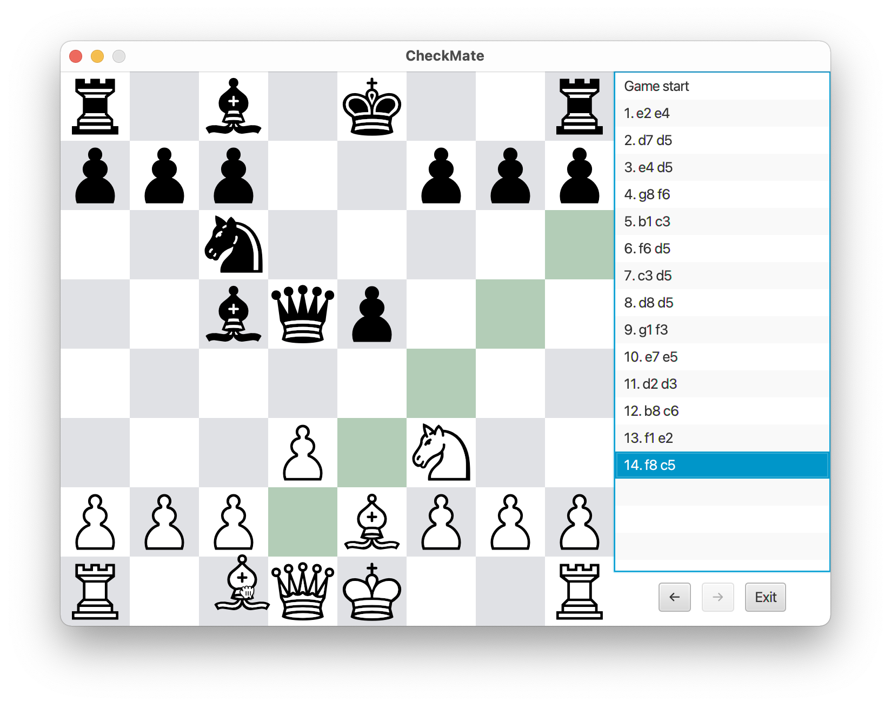

# CheckMate

Project for the 2020/2021 Object Oriented Programming course.

CheckMate is an application for playing chess. The user controls the pawns by dragging the mouse.

The generated moves are fully legal, in particular the following special moves are supported:

- en passant,
- castling,
- pawn promotions,
- check,
- stalemate and checkmate.

During the game the following are highlighted:

- possible moves for the raised piece,
- the last move made,
- king in check.

Possible game modes are standard and Chess960. The game can be played against an opponent in hotseat mode or against a simple computer engine.

In hotseat mode, the players additionally have a move history list available, which can be navigated by arrows or by selecting cells. Selecting a particular game state is reflected on the board; players can go back to the historical state and play the rest of the game in an alternative way.

The pawns and board colors are customizable.

## Launching

The application jar file can be downloaded from the *Releases* tab. The application uses the JavaFX SDK, which can be downloaded from [https://gluonhq.com/products/javafx/](https://gluonhq.com/products/javafx/) (at the time of writing in version 17).

To run the application, run the following command, replacing `PATH_TO_JAVAFX_SDK` with the appropriate path.

```
java --module-path PATH_TO_JAVAFX_SDK/lib --add-modules=javafx.controls,javafx.fxml -jar Checkmate.jar
```

## Screenshots




